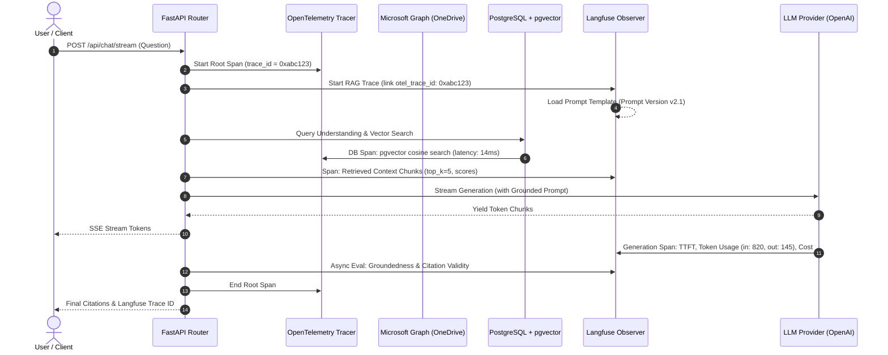

# Implementation Plan: Production-Ready OneDrive Metadata-Aware RAG Chatbot with Dual-Branch Observability (OpenTelemetry + Langfuse)

## Goal Description
Build an enterprise-grade, metadata-aware Retrieval-Augmented Generation (RAG) platform connecting directly to Microsoft OneDrive via Microsoft Graph API, featuring a dedicated **Dual-Branch Observability Architecture**:
- **OpenTelemetry** for infrastructure & system-level telemetry (API traces, DB latency, OneDrive API calls, worker latency, system metrics).
- **Langfuse** for AI & RAG telemetry (LLM traces, RAG retrieval traces, token usage, automated evaluations, prompt versioning, and RAG experiments).
- **Correlation**: Bidirectional linking using the OpenTelemetry `trace_id` attached to Langfuse traces so any AI generation can be traced down to the exact SQL query, Graph API call, and HTTP span.

The platform enables users to authenticate via Microsoft OAuth 2.0, browse and select folders/files, asynchronously ingest and parse diverse document formats (PDF, DOCX, XLSX, PPTX, TXT), extract structural metadata (page numbers, sections, sheet names, slide numbers), index chunks into PostgreSQL using `pgvector`, and interact with their knowledge base through a grounded streaming conversational interface with strict citations back to original OneDrive documents.

---

## Observability Architecture

```text
                    RAG APPLICATION
                          │
              ┌───────────┴───────────┐
              │                       │
              ▼                       ▼
        OpenTelemetry              Langfuse
              │                       │
              │                       ├── LLM traces
              │                       ├── RAG traces
              │                       ├── Token usage
              │                       ├── Evaluations
              │                       ├── Prompt versions
              │                       └── RAG experiments
              │
              ├── API traces
              ├── DB latency
              ├── OneDrive API calls
              ├── Worker latency
              └── System metrics
```

### Correlation & Linkage


---

## User Review Required

> [!IMPORTANT]
> **Dual Observability Setup**:
> 1. **OpenTelemetry**: Standard OpenTelemetry SDK configured in FastAPI. Instruments:
>    - API Traces: HTTP endpoints, response codes, route latencies via `FastAPIInstrumentor`.
>    - DB Latency: PostgreSQL query execution times, connection pool stats via `SQLAlchemyInstrumentor`.
>    - OneDrive API Calls: Microsoft Graph API HTTP requests, rate limit headers, retry attempts via `HTTPXClientInstrumentor`.
>    - Worker Latency: Ingestion background task execution times, file download times, parser latencies.
>    - System Metrics: Process CPU, memory usage, runtime metrics via OTel Resource & Metrics SDK.
>    - Exporter: Console / OTLP exporter (`OTEL_EXPORTER_OTLP_ENDPOINT`).
> 2. **Langfuse**:
>    - LLM Traces: Prompt text, system messages, model hyperparameters, streaming time-to-first-token.
>    - RAG Traces: Candidate retrieval chunks, similarity scores, metadata filters applied.
>    - Token Usage & Cost: Precise prompt/completion token tracking and financial cost per session/user.
>    - Evaluations: Groundedness score (LLM-as-a-judge), context relevance, citation accuracy, user thumbs-up/down.
>    - Prompt Versions: Centrally managed prompt templates fetched by version tag (e.g. `rag-grounded-v1`, `query-classifier-v1`) with local fallback.
>    - RAG Experiments: Metadata tags attached to traces allowing A/B comparison across chunk sizes, prompt iterations, and embedding models.
> 3. **Trace Correlation**:
>    - The OpenTelemetry `trace_id` is automatically injected into Langfuse trace metadata (`otel_trace_id`), enabling 1-click cross-system correlation.

---

## Open Questions

1. **Langfuse Endpoint**:
   - Will you be using **Langfuse Cloud** (free tier at `https://cloud.langfuse.com`, setting `LANGFUSE_PUBLIC_KEY` & `LANGFUSE_SECRET_KEY` in `.env`), or would you like a local self-hosted Langfuse container included in `docker-compose.yml`?
2. **OpenTelemetry Destination**:
   - Would you like OpenTelemetry traces logged to standard output / files in development, or exported to an OTLP collector (e.g., Jaeger / SigNoz / Prometheus)? (We will configure console/OTLP fallback so it works out-of-the-box with zero extra tools required).
3. **Microsoft Entra ID**:
   - Do you want us to start Phase 1 with the built-in **Dev Mock OneDrive Provider** enabled by default so you can test all features immediately, while leaving the real Microsoft Graph OAuth ready for your credentials?

---

## Phased Implementation Roadmap

```text
Phase 1: Project Foundation, Docker & Dual Observability Setup (FastAPI + React + PostgreSQL/pgvector + OTel + Langfuse)
Phase 2: Microsoft OAuth 2.0 & Graph API OneDrive File Explorer (with OTel OneDrive API Spans)
Phase 3: Modular Document Ingestion & Structure-Preserving Extractors (with OTel Worker Latency Spans)
Phase 4: Intelligent Chunking, Embeddings & pgvector Storage (with Langfuse Embedding & Batch Traces)
Phase 5: Grounded RAG Engine, Streaming Chat & Citations (with Langfuse LLM/RAG Traces & Token Tracking)
Phase 6: Metadata-Aware Retrieval, Query Classification & Langfuse Prompt Versioning
Phase 7: Incremental Synchronization & Change Detection
Phase 8: Reranking, Document Comparison & RAG Experiments Tracking
Phase 9: Enterprise Security, Multi-Tenancy & Prompt Injection Hardening
Phase 10: RAG Evaluation Suite (Langfuse Evals, LLM-as-a-Judge, Groundedness Benchmarks) & Documentation
```

---

## Proposed Changes

### Component 1: Dual Observability Core (`backend/app/core/telemetry/`)

#### [NEW] `backend/app/core/telemetry/otel_setup.py`
- Implements the OpenTelemetry branch:
  - Initializes `TracerProvider`, `Resource`, and `BatchSpanProcessor`.
  - Configures `FastAPIInstrumentor` for API traces.
  - Configures `SQLAlchemyInstrumentor` for database query latencies.
  - Configures `HTTPXClientInstrumentor` for Microsoft Graph API requests and external calls.
  - Custom span utilities:
    - `@trace_worker(name)`: Instruments ingestion background worker jobs (file download, parsing, chunking latency).
    - `record_system_metrics()`: Records process memory and active ingestion jobs.
  - Exporter: Standard OTLP exporter with graceful local console logging fallback.

#### [NEW] `backend/app/core/telemetry/langfuse_client.py`
- Implements the Langfuse branch:
  - Initializes Langfuse client with environment credentials (`LANGFUSE_PUBLIC_KEY`, `LANGFUSE_SECRET_KEY`, `LANGFUSE_HOST`).
  - `@observe_rag(name)` decorator:
    - Automatically extracts current OpenTelemetry `trace_id` and attaches it to the Langfuse trace metadata (`otel_trace_id`).
    - Captures prompt input, retrieved context chunks, output tokens, time-to-first-token (TTFT), model name, and user ID.
  - `PromptRegistry`:
    - Manages prompt versions (`rag_system_prompt`, `query_classifier_prompt`) fetched from Langfuse Prompt Management with local fallback templates.
  - `ExperimentTracker`:
    - Tags traces with experiment metadata (e.g. `experiment_id: chunk_size_1000_vs_500`, `retriever: hybrid_vs_dense`).
  - `EvaluationLogger`:
    - Records groundedness, context relevance, and user feedback scores directly against the Langfuse trace.

---

### Component 2: Infrastructure & Monorepo (`/`)

#### [NEW] `docker-compose.yml`
- Multi-service orchestration:
  - `postgres`: Image `pgvector/pgvector:pg16` with volume persistence.
  - `backend`: FastAPI running on port 8000 with hot reload.
  - `frontend`: Vite React on port 5173.
  - `redis`: Task broker and caching.
  - `jaeger` *(optional profile)*: Local OTel UI for inspecting API and DB trace waterfalls.

#### [NEW] `.env.example`
- Complete environment configuration:
  - Microsoft OAuth: `MICROSOFT_CLIENT_ID`, `MICROSOFT_CLIENT_SECRET`, `MICROSOFT_TENANT_ID`, `MICROSOFT_REDIRECT_URI`
  - Database: `DATABASE_URL`
  - AI Providers: `OPENAI_API_KEY`, `OPENAI_MODEL`, `EMBEDDING_MODEL`
  - OpenTelemetry: `OTEL_SERVICE_NAME=onedrive-rag-backend`, `OTEL_EXPORTER_OTLP_ENDPOINT=`
  - Langfuse: `LANGFUSE_PUBLIC_KEY=`, `LANGFUSE_SECRET_KEY=`, `LANGFUSE_HOST=https://cloud.langfuse.com`
  - App: `SECRET_KEY=`, `DEV_MOCK_ONEDRIVE=true`

#### [NEW] `.gitignore`
- Standard exclusions.

---

### Component 3: Backend Core & Database (`backend/`)

#### [NEW] `backend/requirements.txt`
- Web & App: `fastapi`, `uvicorn[standard]`, `pydantic>=2.0`, `pydantic-settings`, `httpx`
- Database: `sqlalchemy>=2.0`, `asyncpg`, `pgvector`, `alembic`, `psycopg2-binary`
- Parsers: `pymupdf` (fitz), `python-docx`, `openpyxl`, `python-pptx`
- AI & Embeddings: `openai`, `tiktoken`, `numpy`
- OpenTelemetry:
  - `opentelemetry-api`
  - `opentelemetry-sdk`
  - `opentelemetry-instrumentation-fastapi`
  - `opentelemetry-instrumentation-sqlalchemy`
  - `opentelemetry-instrumentation-httpx`
  - `opentelemetry-exporter-otlp`
- Langfuse:
  - `langfuse>=2.0.0`
- Testing & Evals: `pytest`, `pytest-asyncio`, `pytest-cov`, `scikit-learn`

#### [NEW] `backend/app/core/config.py`
- Pydantic Settings reading all environment variables.

#### [NEW] `backend/app/core/security.py`
- AES-256 GCM encryption for Microsoft tokens; JWT sessions for clients.

#### [NEW] `backend/app/db/database.py` & `backend/app/models/`
- Async SQLAlchemy engine with models:
  - `user.py`: `User` & `OAuthAccount`
  - `document.py`: `Document` (OneDrive metadata, content hash, sync timestamps)
  - `chunk.py`: `DocumentChunk` (vector(1536), page, section, metadata)
  - `ingestion_job.py`: `IngestionJob` (progress counters, latencies)
  - `chat.py`: `ChatSession` & `ChatMessage` (citations, Langfuse trace_id, user feedback)

---

### Component 4: Microsoft Graph API & OneDrive Integration (`backend/app/services/`)

#### [NEW] `backend/app/services/microsoft_graph.py`
- Async client for Microsoft Graph API instrumented with OpenTelemetry HTTP client spans:
  - Records Graph API endpoint, HTTP method, latency, and status code.
  - Methods: `get_auth_url`, `exchange_code`, `refresh_token`, `list_drive_items`, `get_item_metadata`, `download_file_stream`.
  - Built-in `MockOneDriveService` when `DEV_MOCK_ONEDRIVE=true`.

#### [NEW] `backend/app/api/auth.py` & `onedrive.py`
- Endpoints:
  - `/api/auth/login`, `/api/auth/callback`, `/api/auth/me`, `/api/auth/logout`
  - `/api/onedrive/tree`, `/api/onedrive/folders/{id}/items`, `/api/onedrive/files/{id}/metadata`

---

### Component 5: Document Ingestion & Structure Parsers (`backend/app/processors/` & `services/`)

#### [NEW] `backend/app/processors/`
- `base.py`: Abstract `BaseDocumentParser`
- `pdf.py`: PyMuPDF (`fitz`) page-by-page extraction & page numbers
- `docx.py`: `python-docx` headings & section extraction
- `xlsx.py`: `openpyxl` sheet names & markdown tables
- `pptx.py`: `python-pptx` slides & speaker notes
- `txt.py`: UTF-8/fallback encoding parser

#### [NEW] `backend/app/services/ingestion_service.py`
- Background worker instrumented with OpenTelemetry worker latency spans:
  - `span: download_onedrive_file`
  - `span: parse_file` (tracks latency per file type)
  - `span: chunk_document`
  - `span: generate_embeddings` (logs token counts to Langfuse)
  - `span: pgvector_upsert`
  - Real-time job status updating in `ingestion_jobs`.

#### [NEW] `backend/app/api/ingestion.py`
- `/api/ingestion/start`, `/api/ingestion/{job_id}`, `/api/ingestion/{job_id}/cancel`.

---

### Component 6: Query Understanding, Grounded RAG & Telemetry Correlator (`backend/app/services/`)

#### [NEW] `backend/app/services/query_engine.py`
- Classifies query type (`FACTUAL`, `DOCUMENT_SEARCH`, `SUMMARY`, `COMPARISON`, `METADATA_SEARCH`, `RECENT_CHANGES`).
- Extracts metadata filters (folder, date, file type, document name).
- Instrumented with Langfuse span and versioned prompt template.

#### [NEW] `backend/app/services/retrieval_service.py`
- Combines pgvector cosine similarity search (`<=>`) with SQL metadata filtering and strict tenant isolation (`WHERE user_id = :uid`).
- DB latency captured by OTel SQLAlchemy instrumentation.
- Candidate chunks and scores passed to Langfuse trace.

#### [NEW] `backend/app/services/rag_service.py`
- Strict grounding prompt builder with prompt injection shielding (`<untrusted_reference_document>` quarantine).
- Fetches prompt version from Langfuse Prompt Registry.
- Streams tokens via Server-Sent Events (SSE).
- Captures time-to-first-token (TTFT), total tokens, estimated cost in Langfuse.
- Injects `otel_trace_id` into Langfuse trace metadata and returns `langfuse_trace_id` in final SSE payload.

#### [NEW] `backend/app/api/chat.py`
- `/api/chat/stream`: SSE streaming endpoint.
- `/api/chat/sessions`: Session management.
- `/api/chat/feedback`: Submits thumbs-up/down score to the corresponding Langfuse trace.

---

### Component 7: RAG Evaluation Suite & Experiments (`backend/app/evals/`)

#### [NEW] `backend/app/evals/metrics.py`
- LLM-as-a-Judge and programmatic evaluators:
  - **Groundedness / Faithfulness**: Validates whether response claims are substantiated by retrieved OneDrive chunks.
  - **Retrieval Precision & Recall**: Tests whether top retrieved chunks match ground-truth document IDs.
  - **Citation Accuracy**: Verifies cited references point to existing retrieved chunks and valid page numbers.

#### [NEW] `backend/app/evals/dataset.json`
- Curated ground-truth test suite spanning HR, Finance, Engineering, and Cross-Document comparison questions.

#### [NEW] `backend/app/evals/run_evals.py`
- Benchmark runner that executes queries through the RAG pipeline, computes evaluation metrics, and logs results directly to the Langfuse Evals dashboard under an experiment name.

---

### Component 8: Synchronization & Security (`backend/app/services/`)

#### [NEW] `backend/app/services/sync_service.py`
- Incremental sync checking `modified_date` and `content_hash`. Skips unchanged files, re-embeds modified files, cleans up deleted files.
- Instrumented with OTel spans.

---

### Component 9: Modern React Frontend (`frontend/`)

#### [NEW] `frontend/src/components/Chat/ChatBox.tsx` & `MessageItem.tsx`
- Streaming markdown chat with syntax highlighting, citation drawer linking to OneDrive files, and **Thumbs Up / Down feedback buttons** that link to the Langfuse trace.

#### [NEW] `frontend/src/components/OneDrive/FolderTree.tsx` & `IngestionModal.tsx`
- Interactive recursive tree browser for OneDrive items and live progress bar during indexing.

#### [NEW] `frontend/src/components/Dashboard/KnowledgeBaseStats.tsx`
- Dashboard with total indexed documents, total chunks, sync time, health status, and direct links to OpenTelemetry (Jaeger) and Langfuse dashboards.

#### [NEW] `frontend/src/pages/`
- `Login.tsx`, `Dashboard.tsx`, `OneDriveBrowser.tsx`, `ChatPage.tsx`, `DocumentsPage.tsx`.

---

### Component 10: Documentation (`docs/`)

#### [NEW] `README.md`
- Complete setup and quickstart guide.

#### [NEW] `docs/AZURE_SETUP.md`
- Step-by-step Microsoft Entra ID app registration guide.

#### [NEW] `docs/OBSERVABILITY_GUIDE.md`
- Detailed guide on the dual-branch observability system:
  - Inspecting OpenTelemetry traces (API response times, DB query latency, Graph API latencies).
  - Inspecting Langfuse traces (RAG retrieval candidates, token costs, prompt versions, running evals and experiments).

---

## Verification Plan

### Automated Tests
1. **OpenTelemetry Instrumentation Test**:
   ```bash
   cd backend && pytest tests/test_otel_instrumentation.py -v
   ```
   *Verifies API spans, DB spans, and worker latency spans are created and propagated.*

2. **Langfuse Tracing & Token Tracking Test**:
   ```bash
   cd backend && pytest tests/test_langfuse_tracing.py -v
   ```
   *Verifies LLM spans, RAG retrieval chunk logging, token calculations, and prompt version retrieval.*

3. **Trace Correlation Test**:
   ```bash
   cd backend && pytest tests/test_trace_correlation.py -v
   ```
   *Verifies that the OpenTelemetry `trace_id` is present in Langfuse trace metadata.*

4. **Document Processors Test**:
   ```bash
   cd backend && pytest tests/test_processors.py -v
   ```
   *Verifies PDF, DOCX, XLSX, PPTX, TXT extraction and metadata preservation.*

5. **RAG Automated Evals Benchmark**:
   ```bash
   cd backend && python -m app.evals.run_evals
   ```
   *Runs test cases against the RAG pipeline and publishes scores (Groundedness, Retrieval Recall, Citation Accuracy) to Langfuse.*

### Manual Verification
1. **End-to-End Ingestion Flow**:
   - Start stack with `docker compose up --build`.
   - In OneDrive browser, select a folder and click "Index Selected Documents".
   - Verify OTel records worker latency and file download spans.
2. **Grounded RAG Chat with Streaming & Citations**:
   - Ask a question in chat.
   - Verify SSE token streaming and clickable citations linking to OneDrive.
3. **Observability Verification**:
   - Open OpenTelemetry / Jaeger: inspect the HTTP trace showing route latency, SQL query time, and downstream calls.
   - Open Langfuse: inspect the corresponding trace showing the exact prompt, retrieved context chunks with similarity scores, token counts, cost, and Groundedness evaluation.
4. **User Feedback Capture**:
   - Click Thumbs-Up on an AI answer; verify the score appears under the trace in Langfuse.
